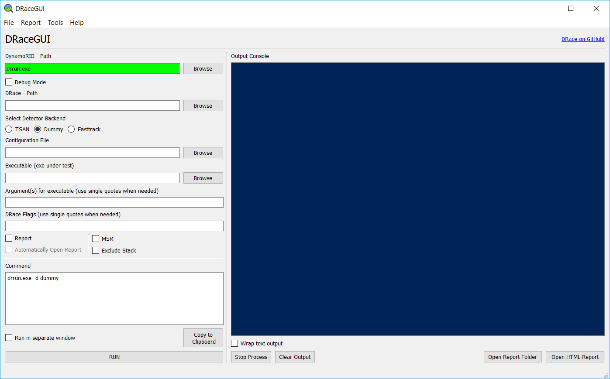
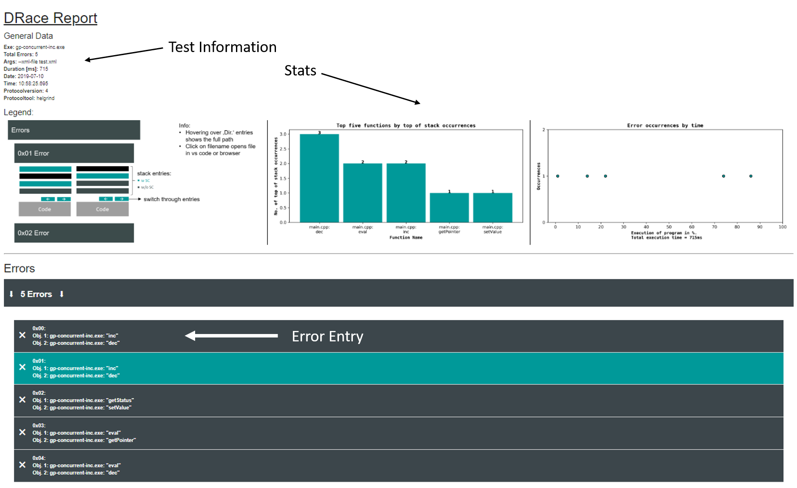
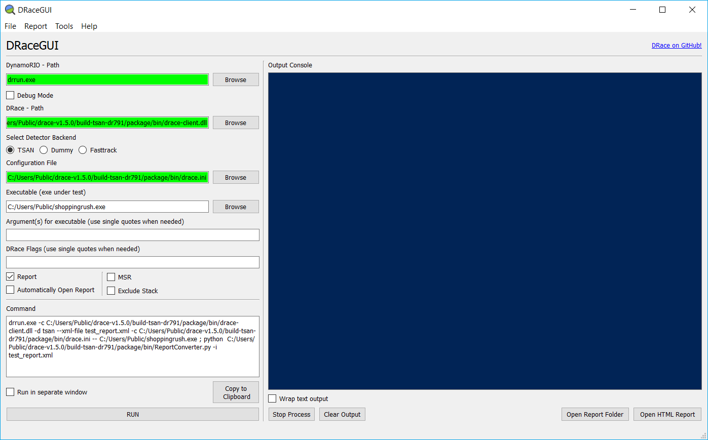

# How to use DRace and its tools

DRace is a data-race detector for windows applications which uses DynamoRIO to dynamically instrument a binary at runtime. This tutorial shall provide an overview on how to get and use DRace and the belonging tools.

This **HowTo** provides explanations about all parts of the usage of DRace. At the end, a [step by step tutorial](#step-by-step-tutorial) is provided, in which you can train your skills in using DRace.

## Get the tools

For the usage of DRace the following components are needed:

- DRace + Tools
- DynamoRio

### DRace + Tools

There are two ways to get DRace. You can download the prebuilt packages from
**[here](https://github.com/siemens/drace/releases)**. The zip-archive must be extracted and you are done.

Alternatively, **[this Git-repository](https://github.com/siemens/drace)**  can be cloned and DRace can be built by yourself.
Further information about how to build DRace by yourself are given in the global [README](https://github.com/siemens/drace/blob/master/README.md) of the repository.

### DynamoRio

DynamoRio is a dynamic instrumentation framework, which is used by DRace. A prebuilt zip-archive can be downloaded **[here](https://github.com/DynamoRIO/dynamorio/releases)**.

It is recommended to use the latest cron build. Once the download is finished, you must extract the zip-archive into a directory. To make the usage of DRace more convenient, it is recommended to put the path of the **drrun.exe**  into the Windows-PATH environment variable: drrun.exe is in ```./DynamoRIO-Windows-<version>/bin64```

## Usage

### GUI-Usage

For new users, the most convenient way to use DRace is to use the DRaceGUI. The ```drace-gui.exe``` is contained in the ```./drace/bin``` folder. With the gui, the quite long and unhandy DRace command can be built in an easier fashion.

Furthermore, a working configuration can be saved in a text file and restored at a later time.
Additionally, some plausibility checks are executed on the inputs. Correct and incorrect inputs are marked with green and red respectively. The fields must be filled as described in the following.
Once all mandatory fields are filled correctly, one can directly execute the command in a powershell-instance by pressing **RUN**. Alternatively, the created command can be copied to the clipboard and pasted in an arbitrary shell.

The following fields are mandatory:

- DynamoRIO - Path: Path to ```drrun.exe```
- DRace - Path: Path to the ```drace-client.dll```
- Select Detector: Select one of the available detectors (more information about detectors are [here](##Detectors))
- Configuration File: Path to ```drace.ini```
- Executable: Path to the application under test

The following fields are optional:

- Debug Mode: This will start DynamoRIO in the debug mode.
- Report: This option will create an HTML-Report after the analysis has finished. To set the option, the report settings must be set correctly ([here](#report-settings))
- MSR: This option starts the managed code resolver, if one wants to analyse applications with .NET code.
- DRace Flags: here additional DRace Flags can be set. Be careful, the string you type in is just copied to the command and not sanitized. Furthermore, use single quotes, when you need quotes. Available DRace flags are [here](#shell-usage)




#### Report-Settings


A nice looking HTML-Report can be created by using the **[ReportConverter](#reportconverter)**. The GUI extends the command such that the ReportConverter is used. Therefore, the path to the Python script `ReportConverter.py` or the `ReportConverter.exe` must be specified in "Report > Configure Report". Also a name for the xml report which is created by DRace must be specified (or just use the default value).

An optional parameter of the Report Converter that could also be specified is the citing of general directories to the source files of the application under test. This is useful especially when the executable is a prebuilt binary, whereby source paths might point to the build environment. Therefore, multiple parent directories could be specified to be recursively searched into for the application's source files.

Note: Python 3 must be installed and in the Windows-PATH environment variable when using the python script.

More information about the ReportConverter is [here](#reportconverter)

### Shell-Usage

**Run the detector as follows**

```bash
drrun.exe -c drace-client.dll <detector parameter> -- application.exe <app parameter>
```

**Command Line Options**

All available command line options can be found [here](https://github.com/siemens/drace/blob/master/README.md).

## Detectors

DRace is shipped with three different detector backends. The detector backend evaluates the program trace which comes from DRace and reports the actual data race.

The following detectors are available:

- tsan (default)
- fasttrack (experimental)
- dummy

Tsan is the default and fastest detector of the three and basically the one to use at the moment. Fasttrack is less optimized than tsan and has only experimental support at the moment. But unlike Tsan, Fasttrack is fully open source. The dummy detector does not detect any races. It is there to evaluate the overhead of the other detectors vs the instrumentation overhead.

## ReportConverter

DRace has the option to create xml reports which contain the detected data races. This xml report can be converted to a nice looking and interactive html document which can help ease the debugging after the usage of DRace. It can be used as follows or with the GUI ([more infos to the usage](https://github.com/siemens/drace/blob/master/tools/ReportConverter/README.md)):

```
Windows:
    python ReportConverter.py -i inputFile [-o outputDirectory -b blacklistItems -w whitelistItems -s sourceDirectories]
    ReportConverter.exe -i inputFile [-o outputDirectory -b blacklistItems -w whitelistItems -s sourceDirectories]

Linux:
    python3 ReportConverter.py -i inputFile [-o outputDirectory -b blacklistItems -w whitelistItems -s sourceDirectories]

```

### Report
The generated Report looks like the following example pictures. The first picture shows an overview, whereas the second one shows a single error entry. The labels pretty much explain all the elements of the report.

Note: If one wants to open a source file by clicking on its name, it will be opened with **VSCode**, if it is installed and the exe of it is in Windows-PATH (must be installed before the report was created). Otherwise, just a new browser tab with the file will be opened.

**Report Overview:**


**Error Entry:**


## Step-by-step Tutorial

Now a step by step example on how to use DRace with an example application will be provided.

### 1. Install DRace and DynamoRIO (if not already installed)

You can find an explanation **[here](#get-the-tools)**.

### 2. Build the ShoppingRush example application

In this demo, we analyze the provided `ShoppingRush` sample application.
The application can easily be built by cloning the DRace repository from Github and pointing CMake to this `HowTo` folder:

```sh
# assume we are in the HowTo folder
mkdir build && cd build
cmake ..
cmake --build . --config RelWithDebInfo
# application should be in .\bin\samples\RelWithDebInfo\
```

*Note: You can also use the provided prebuilt version of the ShoppingRush example,
but as the PDB files contain absolute paths to the source files, the report converter
might not be able to find them.*

### 3. Configure a DRace-Command using the GUI ([more Details](#gui-usage))

    - Find the paths to drrun, drace-client.dll and drace.ini
    - The specified executable must be the delivered sample application `./drace/sample/ShoppingRush.exe` (or `.\bin\samples\RelWithDebInfo\ShoppingRush.exe`)
    - Configure the ReportConverter
    - The report box must be ticked
    - The MSR and Debug Mode box must be unticked
    - Use TSAN as detector



### 4. Execute DRace

After setting everything up in the GUI, it's time to hit the run button and execute DRace for the first time. A powershell window will appear and after a short while and everything went well, you will see something like this. Please note that during runtime, a MSVC "Debug Assertion Failed" might fire, which states "erase iterator out of range" (that already indicates that there is an error in the ShoppingRush application). Please just click cancel and everything should be fine.


There, you can see DRace found either one or two data races and it shows in which folder the report was created. Navigate to the folder and open the `index.html` with a browser of your choice (it is recommended to use Chrome or Firefox).

### 5. Examine the report

After opening the report, you can see where exactly DRace found potential data races (More information about how to read the report is [here](#report)). This is a good starting point to figure out why the code produces data races.

Now, you can start to fix the application.

### 6. Fix the application and rerun DRace

Your job is now to fix the racy parts in the source file. It is located in `./HowTo/shoppingrush/ShoppingRush.cpp`.
If you think you did the trick you can recompile the example application and rerun with DRace. You should compile the application in "debug" mode as otherwise the race might not be exactly detected at the spot of the occurrence. As already described, the debug assertion might fire. If this is the case just click "Cancel" and everything should be fine.

You're done when the application doesn't produce any races anymore, when it is analysed with DRace and still produces the correct output.

### 7. Compare your solution with ours

If you want, you can now compare your solution with the example solution provided in `./HowTo/shoppingrush/ShoppingRushSolution.cpp`.

**A few words to the actual problem:**

The iterator invalidation in line 91 (`shop.erase(elit);`) was recognized by the developer. With the locking of the mutex in line 85 the developer tried to prevent concurrent invalidations of the iterator. The remaining problem which leads to the data races is that this iterator is also used in lines 76, 78 and 79.
Additionally, the pattern `size_t size = shop.size();` ... `if(size != 0)` is also erroneous, as the size of the shop might have changed between the two statements.
There it won't be invalidated, but an already invalidated iterator may be used. This leads to an undefined behavior of the application. If the locking of the mutex is moved above line 74 (`int size = shop.size();`) everything is safe and should work fine.

🎉🎉🎉Congrats, you're done with the tutorial. 🎉🎉🎉
